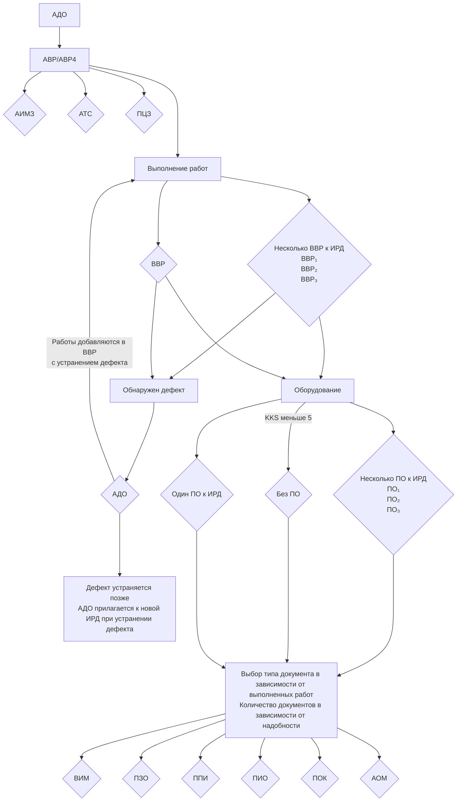
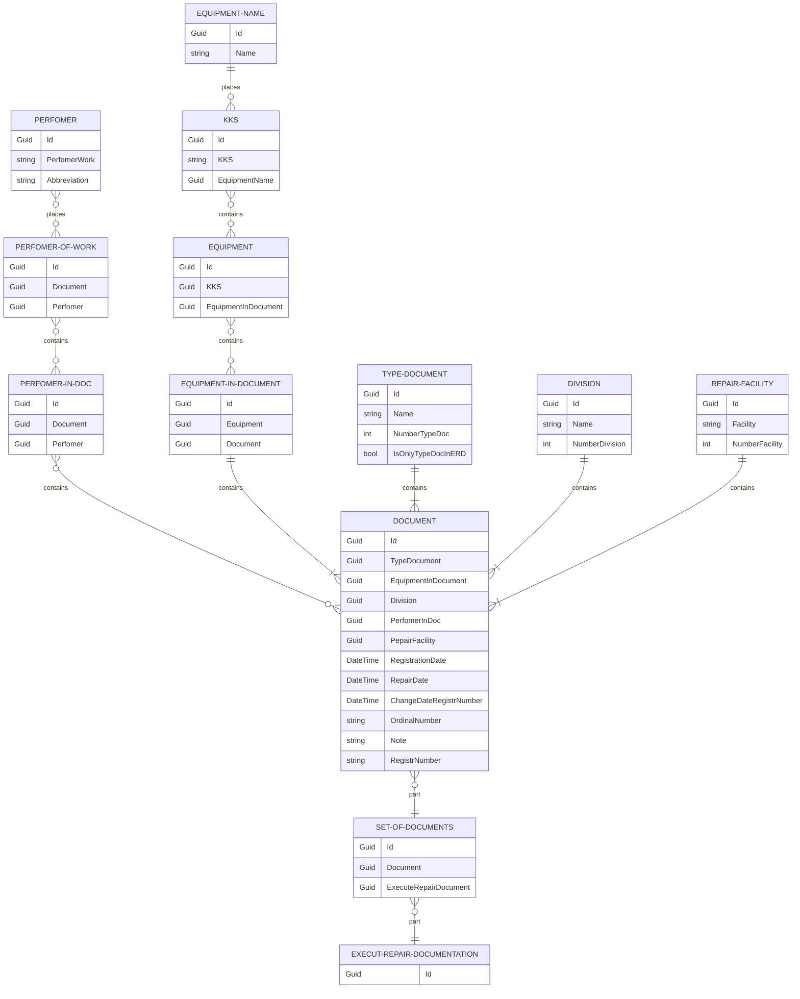

# Техническое задание для приложения  "Журнал регистрации исполнительной ремонтной документации"

## Аббревиатуры
- **ЭБ** — Энергоблок;
- **ОСО** — Общестанционное оборудование;
- **ИРД** — Исполнительная ремонтная документация;
- **KKS (Kraftwerk – Kennzeichen — System)** — это система кодирования и записи данных (оборудования);
- **ТОиР** — Техническое обслуживание и ремонт;
- **ТО** — Техническое обслуживание;
- **ТР** — Текущий ремонт;
- **СР** — Средний ремонт;
- **КР** — Капитальный ремонт;
- **НР** — Неплановый ремонт;

### Виды локальных документов:
- **Чек-лист** — Чек-лист исполниетльной ремонтной документации по ремонту оборудования
- **АВР** — Акт о выполненных  работах по ремонту оборудования;
- **АВР4** — Акт о выполненных  работах по ремонту оборудования (класс безопасности 4);
- **ПО** — Перечень оборудования к акту о выполненных работах по ремонту оборудования;
- **ВВР** — Ведомость выполненных работ;
- **ВИМ** — Ведомость фактически затраченных (Используемых) материалов и запасных частей;
- **АДО** — Акт о дефектах оборудования (трубопроводов);
- **ПЗО** — Протокол закрытия оборудования;
- **ППИ** — Протокол проверки исправности оборудования после ремонта;
- **ПИО** — Протокол испытания оборудования на плотность;
- **ПОК** — Протокол операционного контроля при ремонте оборудования;
- **АИМЗ** — Акт об использовании материалов заменителей при ремонте;
- **АОМ** — Акт окончания монтажа оборудования (трубопровода);
- **АТС** — Акт о техническом состоянии оборудования;
- **ПЗЦ** — Протокол закрытия цилиндра турбины.
 
### Сокращения должностей:
- **ПЗГДГИ** — Первый заместитель главного директора - главный инженер АЭС;
- **ЗГИР** — Заместитель главного инженера по ремонту АЭС.

## Назначение приложения

Приложение необходима для регистрации и учета исполнительной ремонтной документации локального назначения. У каждого подразделения (цех/отдел) есть оборудование которое за ним закреплено. Каждому подразделению соответствует определённый номер (идентификатор), который не меняется с течением времени.  Для нормальной эксплуатации оборудования необходимо поддерживать его техническое состояние путём проведения регламентных работы на оборудовании.
В случае отказа оборудования выполняются работы по устранению выявленного дефекта (оформляется АДО с даты обнаружения дефекта и подкладывается к перечню ИРД после ремонта) с последующим оформлением ИРД.

## Подразделения и их номера

В таблице 1 приведены подразделения с оборудованием для проведения ТОиР (может дополняться по мере добавления подразделений).

Таблица 1
|Название подразделения|Аббревиатура|Номер|
|----------------|-------------------------------|-----------------------------|
|Автотранспортный цех|   АЦ   |11|
|Реакторный цех|   РЦ   |21|
|Турбинный цех|   ТЦ   |22|
|Цех обеспечивающих систем|   ЦОС   |23|
|Химический цех|   ХЦ   |24|
|Цех вентиляции и кондиционирования|   ЦВиК   |25|
|Цех тепловой автоматики и измерений|   ЦТАИ   |26|
|Электрический цех|   ЭЦ   |27|
|Цех по обращению с РАО|   ЦОРО   |30|
|Отдел ядерной безопасност|   ОЯБ   |31|
|Цех радиационной безопасности|   ЦРБ   |32|
|Цех централизованного ремонта|   ЦЦР   |35|
|Цех дезактивации|   ЦД   |36|
|Лаборатория производственная по дефектоскопии и техническому контролю|   ЛПДТК   |37|
|Отдел подготовки и проведения ремонтов|   ОППР   |38|
|Отдел управления ресурсом и модернизации|   ОУРМ   |54|
|Административно-хозяйственный цех|   АХО   |60|

### Чек-лист
Чек-лист оформляется для определения комплектности документации и отметки [да|нет|требуется оформить] всех предоставленных документов при передаче ИРД подразделению владельца оборудования. Данный документ имеет номер, который соответствует АВР/АВР4. Документ согласовывается с подразделением владельца оборудования и подписывается при передаче полного комплекта.

### АВР/АВР4 (Акт о выполненных  работах по ремонту оборудования / -/- (4 класс безопасности)
Документ оформляется в единственном числе для ИРД. Имеет две формы АВР (для оборудования 2 и 3 класса безопасности) и АВР4 (для оборудования 4 класса безопасности). Для оборудования 4 класса безопасности можно оформлять как АВР.
Документ содержит перечень документов используемых для оценки ремонта оборудования, срока гарантии на отремонтированное оборудование, даты проведения работ и т.д. 
Отличия АВР от АВР4:
- Утверждает ЗГИР;
- Подписывается за "Комплектность и правильность оформления" и "Соответствие СТО к ИРД";

### ВВР (Ведомость выполненных работ)
Документ прилагаемый к АВР содержащий перечень работ которые выполнили исполнитель(ли) работ со ссылкой на перечень документов по которым выполнялись работы.
Особенности связей ВВР к ИРД:
- Оформляется 1(один)  и(или) несколько на ремонт оборудования;
- Исполнители работ могут быть привязаны к одному ВВР как 1(один) и(или) несколько;
- Может оформляться на разный тип оборудования индивидуально (В ПО 3 типа оборудования, можно составить 3 ВВР или один который содержит 3 разных типа ведомостей);
- ВВР может прилагаться как к одному комплекту ИРД, так и к другому (но основная связь с 1 ИРД).

### ПО (Перечень оборудования к акту о выполненных работах по ремонту оборудования)
Документ содержит список оборудования (5 и более) на котором проводились ТОиР. Комплектовать оборудование можно по принадлежности к одному комплексу (ЭБ № 1 / ЭБ № 2 / ОСО) и принадлежности к одному заводу изготовителю. Прикладывается к одной ВВР (при необходимости) при оформлении ИРД.

### ВИМ (Ведомость фактически затраченных (Используемых) материалов и запасных частей)
Документ прикладывается к ИРД в случае использования каких-то материалов (и)или запасных частей. Прикладывается индивидуально к каждому комплекту ИРД. 

### АДО (Акт о дефектах оборудования (трубопроводов))
Документ оформляется в случае обнаружения дефекта и может прикладываться к одному комплекту ИРД несколько АДО при:
- При проведении ТОиР оборудования (АВР, а после может оформиться АДО, если обнаружен дефект);
- При потере работоспособности или отклонений параметров работы оборудования (Составляется АДО, а далее после устранения дефекта остольной комплект ИРД).

###  ПЗО (Протокол закрытия оборудования)
Документ оформляется на одно оборудование/деталь после ремонта на закрытие оборудования или составных частей оборудования. Может прилагаться к ИРД во множественном количестве. К одному оборудованию может быть приложено несколько ПЗО на детали (Например при ремонте насоса закрыли два подшипника, тогда будет 3 ПЗО: два на подшипника и один на оборудование).

### ППИ (Протокол проверки исправности оборудования после ремонта)
Документ прилагается для подверждения проверки исправности оборудования после ремонта. В большинстве случаев необходимо приложить ППИ для ТО. Может оформляться на несколько наименований (KKS) в одном числе,  так и во множественном. В случае классного оборудования (2 и 3 класса безопасности) оформляется ППИ один на одно наименование.

### ПИО (Протокол испытания оборудования на плотность)
Документ оформляется после проведения гидравлических испытаний на оборудовании. Протокол оформляется на 1 и(или) более однотипных оборудований. На оборудование 2 класса оформляется индивидуально.

### ПОК (Протокол операционного контроля при ремонте оборудования)
Документ оформляется на 1 и(или) несколько наименований (KKS) однотипных оборудований. Составляется для работ по: ТР, СР, КР и устранения дефектов/неплановый ремонт.

### АИМЗ (Акт об использовании материалов заменителей при ремонте)
Документ составляется, подписывается и утверждается для использования детали/материала при ремонту, который не предусмотрен ремонтной/конструкторской документацией. Оформляется дополнительно к АВР. Обычно больше 1(одного) АИМЗ не оформляется.

### АОМ (Акт окончания монтажа оборудования/трубопровода)
Документ оформляется для монтажа оборудования/трубопровода после ТОиР или при монтаже оборудования. Оформляется на 1 и(или) несколько наименований (KKS) однотипных оборудований.

### АТС (Акт о техническом состоянии оборудования)
Документ составляется когда необходимо подтвердить работоспособность и техническое состояние какого-либо оборудования. Составляется на 1 и(или) несколько наименований (KKS) однотипных оборудований. Может оформляться как один независимый документ.

### ПЗЦ (Протокол закрытия цилиндра турбины)
Документ оформляется индивидуально на каждое закрытие цилиндра турбины. 

## Диаграмма зависимостей документов

## ER‑диаграмм 

## Этапы разработки
1. Создание проекта "Core" для описания базового функционала.
   1. Создание классов (моделей) для описания объектов согласно ER-диаграммы;
   2. Создание/Формирование БД согласно описанным объектам;
   3. Создание репозитория(ев) и сервиса(ов) для репозиториев;
2. Создание проекта "Console" для проверки добавленного функционала;
3. Создание проекта для Миграций БД.
4. Создание проекта WPF для использования базового функционала.
   1. Создание WPF проекта и определение компановки элементов для реализации функционала приложения;
   2. Добавление элементов управления для проекта;
   3. Реализация добовления документа в БД;
   4. Реализация удаления документа из БД и всех связанных с ним документов;
   5. Реализация возможности добавления нового документа к связанным документам;
   6. Возможность изменить/удалить/добавить информацию для документа(ов).
